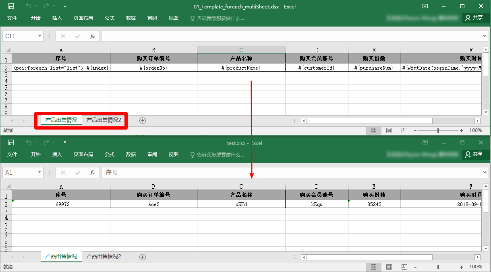
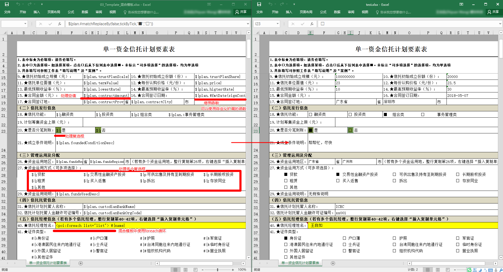

# poi-el
excel导出与导入神器，poi-el。  
* poi-el支持强大的excel模板导出功能  
* poi-el能很方便的支持导出函数扩展（EL的特性）  
* poi-el支持方便的excel导入API  

## maven 依赖  
```xml
<dependency>
  <groupId>com.github.kevin-wang001</groupId>
  <artifactId>poi-el</artifactId>
  <version>2.0.1</version>
</dependency>
```

## excel模板导出
使用poi + spEl，支持各种普通模板和复杂模板的导出功能
### Quick Start:
参考：  
com.kvn.poi.export_test.ForeachTest.java  
com.kvn.poi.export_test.MixTemplateTest.java  
com.kvn.poi.export_test.MultiPoiForeachTest.java  
  
**API:**  
>
	PoiExporter.export2Destination(InputStream templateInputStream, Map<String, Object> rootObjectMap, OutputStream des)
**模板示例**  

## 普通模板：  
  

## 多sheet模板
 

## 复杂模板——多个foreach模板：  
  
  
## 复杂模板——混合模板：  
  

## 导出函数扩展  
* 注册扩展函数到上下文中
poi-el默认会去读取 **META-INF/poi-el/poi-el-functions** 文件，里面存放扩展函数类的全限定名。  
poi-el内部默认注册了 [InternalUtils](src/main/java/com/kvn/poi/exp/function/InternalUtils.java) ：  
>  
    # 内部函数
    com.kvn.poi.exp.function.InternalUtils
当然，开发者也可以将自定义的函数扩展添加到自己的工程目录文件 META-INF/poi-el/poi-el-functions 下
使用形如：（参考：[03_Template_混合模板.xlsx](src/test/resources/template/03_Template_混合模板.xlsx)）  
>   
    ${#fmtDate(endDate,'yyyy-MM-dd')}

* 直接使用没有注册到上下文中的函数  
我们可以直接使用没有注册到上下文中的函数，不过需要指定方法的全限定名：（EL调用函数，是不是很强大^_^）  
例如：  
>   
    #{ T(com.kvn.poi.exp.function.NotRegistedFunction).fmtString(keyName) }
  
## excel模板导入
支持简洁易用的excel导入API  
### Quick Start:
参考:  
com.kvn.poi.import_test.ImportRawTest.java  
com.kvn.poi.import_test.ImportGenericTest.java  
  
**API**
>
	PoiSheetVo sheetVo = PoiImporter.importFirstSheetFrom(is);

>
	PoiGenericSheetVo<OrderImportVo> genericSheetVo = PoiImporter.importFirstSheetFrom(is, OrderImportVo.class);

# 计划  
1. 后续可以考虑使用MyBatis解析动态SQL的思想，来扩展属性占位符（${}、#{}等）和数据来源（rootObjectMap，可以有多来源），将属性占位符和数据来源解耦

